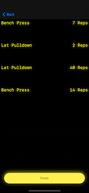

# 👋🏻 Hello 
# Thank you for volunteering to take part in our study!
This message should help guide you through getting started. Again, we 
thank you for your participation!

## 🖐🏾 Consent
Before you begin please take a moment to complete and return the [IRB approved consent form](files/irb-consent.pdf).
Send completed and signed forms to Alex Launi <alaun001@odu.edu>.

## 🏃🏿‍♀️ Getting Started
Now that the administrative protocols have been met we can commence the fun part!

You should have (or will shortly) received a sensor and a neoprene arm strap. The sensor is battery powered and is charged via micro-usb. Please make sure to charge the sensor before use. The sensor needs 2hrs to fully charge and unfortunately does not give any visual indication of charge status. I recommend keeping it plugged in between sessions.

After I have verified your consent form and you have your sensor you will receive an email from Apple with the subject line, "Alexander Launi has invited you to test LiftRight". This email has instructions on how to install the iOS application "LiftRight". Please install the app onto your iPhone!

## 📲 Setting up prior to exercising
Working out with LiftRight is easy and *(we hope)* fun. 
When you launch LiftRight for the first time it will ask permission to use Bluetooth. Please accept these permissions; they are required for communication with the sensor.

* In the **welcome screen** press `Begin Workout` to begin.
  
  

* You will be presented with a list of sensors. There will likely only be one, but if multiple sensors are discovered they will all be shown here. Select the one with the best signal to connect the sensor.  
  
  

* If no sensors are found try bringing your phone closer to the sensor. 
  
  
  
* The sensor needs to be calibrated before use.The next screen gives directions on how to wear and orient the sensor for use. The sensor should be worn on your **left arm** with the grey dot facing **down and away from your body**. When ready press the `calibrate` button at the bottom and stand still with your arm hanging down at your side.

  

## 🏋🏼‍♂️ Working Out

LiftRight tracks your movement and derives performance data for a variety of upper body exercises. Scroll through the available exercises and select one to track that exercise.

  

For your first few sessions you will see a large counter. LiftRight will count your repetitions. This display will change as the study progresses.

No interaction is needed between sets, LiftRight will automatically start a new set after a short timeout where no reps were performed.

### 🤷🏻‍♀️ What about exercises that LiftRight doesn't track?
If your workout includes exercises that aren't tracked by LiftRight, like squats or deadlifts, simply pause LiftRight.

  
  

Follow the same workflow to resume when you're ready to continue with tracked exercises.

## 🏁 Finishing Up
When you're finished exercising select `End Session`

  
  

You'll be shown a summary of your performance, and may be presented a survey after you press `Finish`

  
  

Please complete this survey when it's presented!

# 🧐 Any Questions?
If you have any questions, problems, or feedback outside of the data collected in the study please contact me, alaun001@odu.edu
